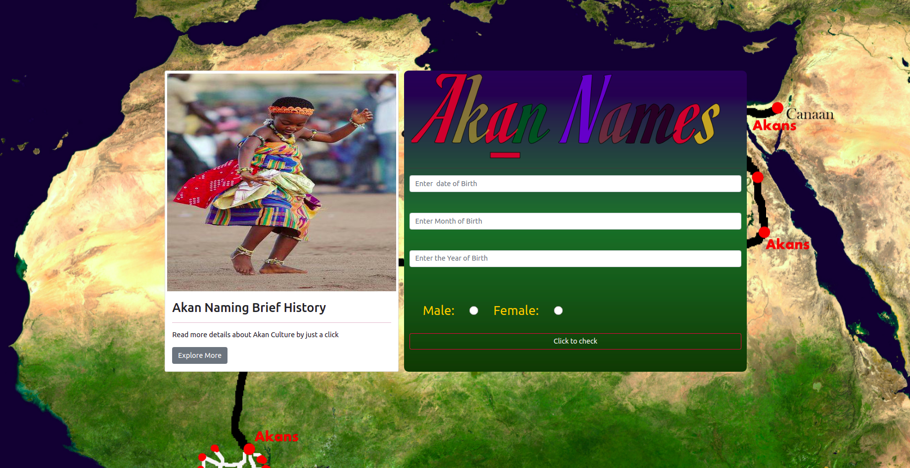
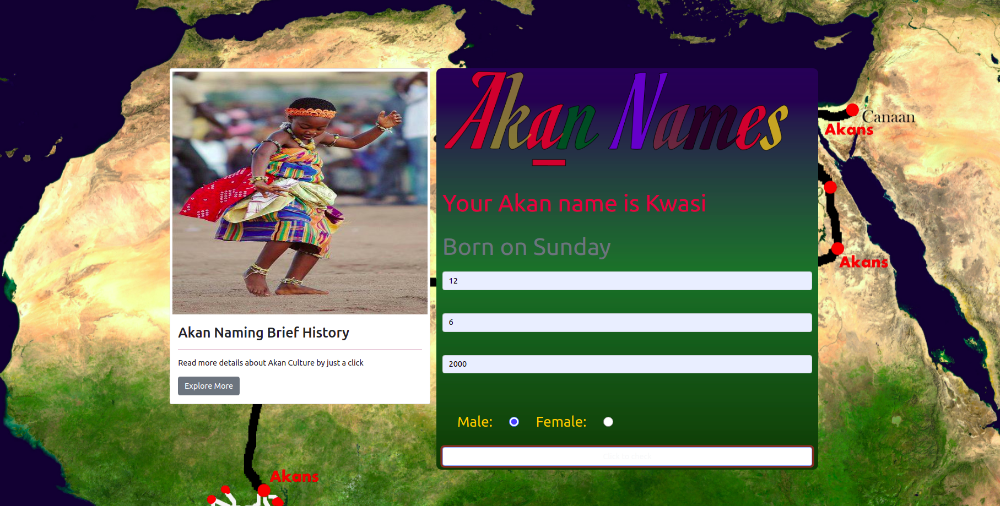
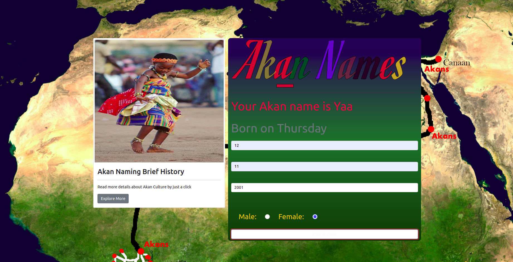

# Akan Name website Application
## Created and designed by Joseph Gakumo Munyui on 15th July 2021
# Description
## The Akan name website generation is an application that enables the user to know his or her name of birth if he/she was a member of Akan community . The website allows the user to type in date of birth, the month of birth and the year then it uses this details to determine when that iidividual was born and which exact date

# Setup requirements
* Chrome Browser
* Git
* Bootstrap 5
# Technology used and Programming Languages
 * HTML
 * Bootstrap
 * Javascript

 # Active link to Portfolio
 <a href="https://joegakumo21.github.io/AkanNameProject-IP/">Akan Name website Application</a>

 # Known Bugs
  * so far  has no errors
 # Feedback and recommendations
 * You can reach me via
 * joegakumo1@gmail.com
 * tel : +254791279635

 # some screen shots of the site 

# Licence
<a href="https://choosealicense.com/licenses/mit/">MIT Licence</a>

MIT License

Copyright &copy; 2021, JOSEPH GAKUMO MUNYUI,

Permission is hereby granted, free of charge, to any person obtaining a copy
of this software and associated documentation files (the "Software"), to deal
in the Software without restriction, including without limitation the rights
to use, copy, modify, merge, publish, distribute, sublicense, and/or sell
copies of the Software, and to permit persons to whom the Software is
furnished to do so, subject to the following conditions:

The above copyright notice and this permission notice shall be included in all
copies or substantial portions of the Software.

THE SOFTWARE IS PROVIDED "AS IS", WITHOUT WARRANTY OF ANY KIND, EXPRESS OR
IMPLIED, INCLUDING BUT NOT LIMITED TO THE WARRANTIES OF MERCHANTABILITY,
FITNESS FOR A PARTICULAR PURPOSE AND NONINFRINGEMENT. IN NO EVENT SHALL THE
AUTHORS OR COPYRIGHT HOLDERS BE LIABLE FOR ANY CLAIM, DAMAGES OR OTHER
LIABILITY, WHETHER IN AN ACTION OF CONTRACT, TORT OR OTHERWISE, ARISING FROM,
OUT OF OR IN CONNECTION WITH THE SOFTWARE OR THE USE OR OTHER DEALINGS IN THE
SOFTWARE.